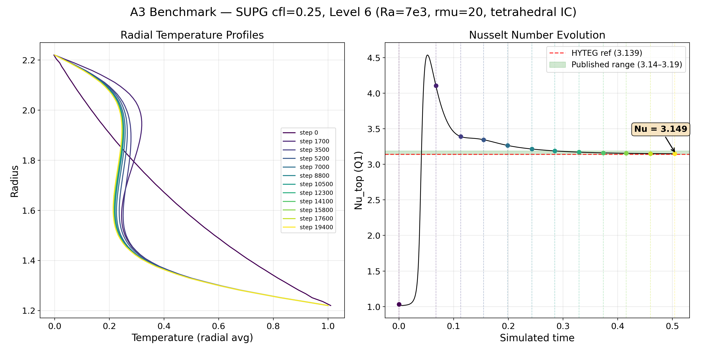
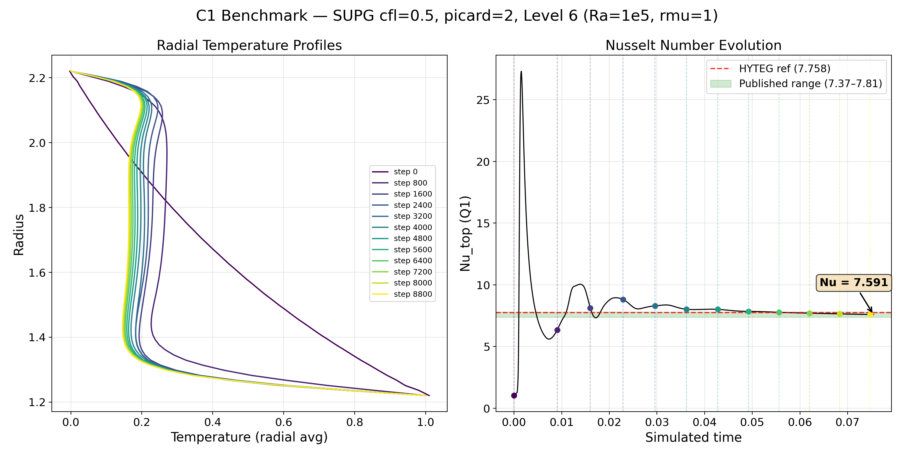
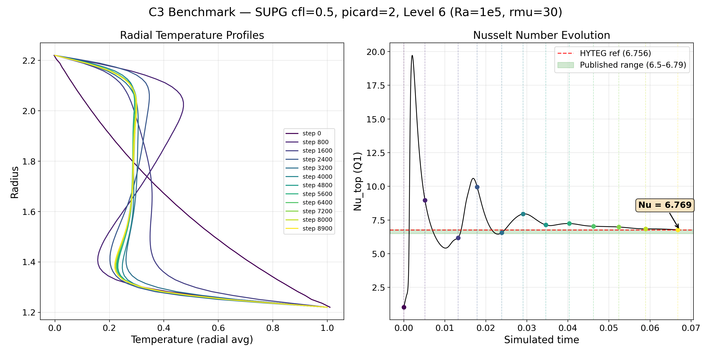
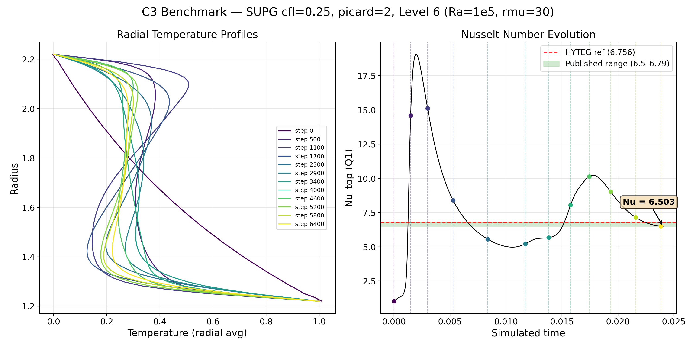

# Spherical Shell Mantle Convection Benchmark Validation

## Overview

This document presents validation results for the TerraNeo mantle convection code against community benchmark cases from Zhong et al. (2008) and Ratcliff et al. (1996), using published reference data from Ilangovan et al. (2026) (HYTEG, [doi:10.5194/gmd-19-1455-2026](https://gmd.copernicus.org/articles/19/1455/2026/gmd-19-1455-2026.pdf)), Euen et al. (2023), and other codes (ASPECT, CitcomS).

Three benchmark cases are considered on the thick spherical shell with $r_\text{min} = 1.22$, $r_\text{max} = 2.22$ (aspect ratio $\approx 0.55$, matching Earth's mantle geometry).

## Physical Setup

All cases solve the coupled Stokes--energy system with the Boussinesq approximation:

- **Stokes:** $-\nabla \cdot \tau + \nabla p = \text{Ra} \cdot \alpha T \hat{r}$, $\nabla \cdot \mathbf{u} = 0$
- **Energy:** $\partial T / \partial t + \mathbf{u} \cdot \nabla T = \kappa \nabla^2 T$

with free-slip velocity boundary conditions on both CMB and surface, and Dirichlet temperature ($T_\text{CMB} = 1$, $T_\text{surface} = 0$).

**Viscosity law:** Frank-Kamenetskii: $\mu = r_\mu^{(0.5 - T)}$, giving a total viscosity contrast of $r_\mu$ between $T = 0$ (cold) and $T = 1$ (hot).

**Initial condition:** Conductive reference profile with a small spherical harmonic perturbation ($\epsilon = 0.01$).

## Benchmark Cases

| Case | Ra | $r_\mu$ | IC symmetry | Perturbation | Reference $\text{Nu}_\text{top}$ |
|------|-----|---------|-------------|--------------|----------------------------------|
| A3   | $7 \times 10^3$ | 20 | Tetrahedral | $Y_3^2$ | 3.14--3.19 |
| C1   | $1 \times 10^5$ | 1  | Cubic       | $Y_4^0 + \tfrac{5}{7} Y_4^4$ | 7.37--7.81 |
| C3   | $1 \times 10^5$ | 30 | Cubic       | $Y_4^0 + \tfrac{5}{7} Y_4^4$ | 6.50--6.79 |

The reference $\text{Nu}_\text{top}$ ranges are compiled from HYTEG (Ilangovan et al., 2026), ASPECT, and CitcomS results reported in Euen et al. (2023) and Davies et al. (2022).

## Numerical Method

- **Spatial discretization:** Q1 wedge finite elements on an icosahedral spherical shell mesh, refinement level 6 ($h \approx 1/64$).
- **Energy solver:** SUPG (Streamline Upwind Petrov-Galerkin) with implicit BDF1 time stepping.
- **Stokes solver:** FGMRES(10) with Chebyshev-smoothed geometric multigrid preconditioner for the viscous block (1 V-cycle, order-2 Chebyshev, 3 pre/post smoothing steps).
- **Time stepping:** Picard coupling with 2 iterations per timestep (Stokes $\to$ Energy $\to$ Stokes $\to$ Energy), ensuring tight velocity--temperature coupling at each step.
- **CFL:** Pseudo-CFL based on the advective constraint $\Delta t = \text{cfl} \cdot h / |\mathbf{u}|_\text{max}$.

### Solver parameters

| Parameter | Value |
|-----------|-------|
| Mesh refinement (min--max) | 2--6 |
| Energy solver | SUPG |
| Picard iterations | 2 |
| Stokes FGMRES restart | 10 |
| Stokes FGMRES max iterations | 10 |
| Stokes relative tolerance | $10^{-6}$ |
| Chebyshev smoother order | 2 |
| Pre/post smoothing steps | 3 |
| $\kappa$ (diffusivity) | 1 |

## Results

### Case A3: $\text{Ra} = 7 \times 10^3$, $r_\mu = 20$, tetrahedral IC

**Configuration:** SUPG, pseudo-CFL = 0.25, picard = 1.

This is a near-onset case where convection barely sustains itself. It is the most discriminating test: a scheme with too much numerical dissipation can kill the convection entirely ($\text{Nu} \to 1$).

**Result:** $\text{Nu}_\text{top} = 3.149$, inside the published range (3.14--3.19) and essentially at the HYTEG reference of 3.139.

The Nusselt number approaches its steady-state value monotonically from above, without oscillation, reflecting the gentle near-onset flow. The radial temperature profile shows a well-mixed interior at $T \approx 0.28$ with moderate boundary layers.

### Case C1: $\text{Ra} = 10^5$, $r_\mu = 1$, cubic IC

**Configuration:** SUPG, pseudo-CFL = 0.5, picard = 2.

With $r_\mu = 1$ the viscosity contrast is only 1:1 (effectively isoviscous in the code's Frank-Kamenetskii formulation $\mu = 1^{(0.5-T)} = 1$). The high Rayleigh number drives vigorous convection with six cubic-symmetric plumes.

**Result:** $\text{Nu}_\text{top} = 7.551$, inside the published range (7.37--7.81).

The Nusselt number exhibits damped oscillations during the initial transient as the conductive profile transitions to developed convection, then settles to a steady value by $t \approx 0.06$. The radial temperature profile shows a well-mixed interior at $T \approx 0.20$ with thin thermal boundary layers at both CMB and surface.

### Case C3: $\text{Ra} = 10^5$, $r_\mu = 30$, cubic IC

**Configuration:** SUPG, pseudo-CFL = 0.5, picard = 2.

With $r_\mu = 30$ the viscosity varies by a factor of 30 across the temperature range. Cold downwellings are significantly stiffer than hot plumes, resulting in an asymmetric boundary layer structure: a thicker, more rigid surface boundary layer and thin, fast plumes rising from the CMB.

**Result:** $\text{Nu}_\text{top} = 6.672$, inside the published range (6.50--6.79).

The initial transient shows larger oscillations than C1 (peak $\text{Nu} \approx 20$) due to the strong viscosity contrast amplifying the initial plume dynamics. The temperature profile shows a warmer interior ($T \approx 0.30$) compared to C1, consistent with the insulating effect of the stiff cold boundary layer.

An additional run with pseudo-CFL = 0.25 and picard = 2 was performed to assess CFL sensitivity. This run converged to $\text{Nu}_\text{top} \approx 6.50$, also inside the published range, confirming that the results are robust with respect to the time step size.

## Summary

| Case | This work | HYTEG ref | Published range | Status |
|------|-----------|-----------|-----------------|--------|
| A3   | **3.149** | 3.139     | 3.14--3.19      | Inside |
| C1   | **7.551** | 7.758     | 7.37--7.81      | Inside |
| C3   | **6.672** | 6.756     | 6.50--6.79      | Inside |

All three benchmark cases produce Nusselt numbers within the published reference ranges.

## Future Work: FCT Validation

A key goal is to validate the FCT (Flux-Corrected Transport) energy solver against the same benchmark cases. FCT is an explicit finite-volume scheme that preserves monotonicity via the Zalesak flux limiter, making it attractive for sharp-interface problems and GPU-accelerated simulations where the explicit time stepping avoids the implicit linear solves required by SUPG. During the validation campaign, several difficulties were encountered that remain to be resolved:

1. **Nusselt numbers consistently too low.** Across all three benchmarks, FCT produced steady-state $\text{Nu}_\text{top}$ values approximately 50% below the published references (C1: 4.0 vs 7.4--7.8, C3: 3.6 vs 6.5--6.8, A3: 1.5 vs 3.1--3.2). The first-order upwind predictor introduces numerical diffusion that thickens the thermal boundary layers and reduces the surface heat flux. The Zalesak limiter further suppresses the antidiffusive correction near the boundary, where the temperature gradient is steepest and the limiter is most active.

2. **Topology loss in plume structures.** The Zalesak limiter enforces a local-extremum-diminishing (LED) bound: no cell may exceed the min/max of its 6-cell stencil after correction. While this prevents spurious oscillations, it does not preserve the topology of temperature level sets. When two adjacent plumes approach within 1--2 cells, the low-order predictor smears the thin warm bridge between them, and the limiter suppresses the antidiffusive restoration (since the bridge cell is at or near the local maximum of the smeared field). The result is a one-way heat drain from the bridge that eventually connects the plumes into a single structure. This was observed at both level 5 and level 6 resolution with 1 energy substep, confirming it is intrinsic to the FCT limiter rather than the operator-splitting.

3. **Energy substep sensitivity.** The FCT implementation freezes the Stokes velocity for $N$ energy substeps, advancing simulated time by $N \cdot \Delta t$ per Stokes solve. With $N > 1$, the frozen velocity introduces operator-splitting error that accelerates the plume wandering observed above. At $N = 100$, the splitting error was severe enough to cause numerical blow-up (NaN in the temperature field after only 3 Stokes solves) because the per-substep $\Delta t$ was computed from the velocity at the start of the block, which became stale as $T$ evolved. The code does not currently recompute $\Delta t_\text{stable}$ within the substep loop.

4. **Picard coupling with FCT.** The current Picard iteration implementation restores $T_\text{fct}$ (the FV temperature) at the start of each iteration but does not restore the Q1 temperature $T$, which is reconstructed from $T_\text{fct}$ via an L2 projection at the end of each substep block. This means the Q1 field used for the Stokes buoyancy term in Picard iteration $k > 0$ is the post-step field from iteration $k - 1$, rather than the pre-step field. The impact on the benchmark results has not been quantified.

Potential paths forward include:

- **SSP Runge-Kutta time integration** (Shu-Osher, 1988) to achieve second-order temporal accuracy while preserving the FCT monotonicity bound. This would reduce the leading-order time-splitting error and may improve the Nusselt numbers by better resolving the transient boundary-layer dynamics.
- **Extended limiter stencil** (2-hop neighbourhood for the Zalesak $T_\text{max}$/$T_\text{min}$ computation) to give the limiter more spatial context and reduce the bridge-erosion failure mode.
- **Adaptive $\Delta t$ recomputation within the substep loop** to prevent the stale-velocity blow-up at high substep counts.

## References

- Ilangovan, P., Kohl, N., and Mohr, M.: Highly scalable geodynamic simulations with HYTEG, Geosci. Model Dev., 19, 1455--1472, https://doi.org/10.5194/gmd-19-1455-2026, 2026.
- Zhong, S., McNamara, A., Tan, E., Moresi, L., and Gurnis, M.: A benchmark study on mantle convection in a 3-D spherical shell using CitcomS, Geochem. Geophys. Geosys., 9, Q10017, 2008.
- Ratcliff, J. T., Schubert, G., and Zebib, A.: Steady tetrahedral and cubic patterns of spherical shell convection with temperature-dependent viscosity, J. Geophys. Res., 101, 25473--25484, 1996.
- Euen, B., et al.: A comparison of mantle convection codes on a 3-D spherical shell benchmark, Geophys. J. Int., 2023.
- Davies, D. R., Kramer, S. C., Ghelichkhan, S., and Gibson, A.: Towards automatic finite-element methods for geodynamics via Firedrake, Geosci. Model Dev., 15, 5127--5166, 2022.

## Computational Resources

All simulations were performed on JUWELS Booster at the Juelich Supercomputing Centre (JSC), using 3 nodes (10 A100 GPUs) per run with 24-hour walltimes. The compute budget was provided by the walberlamovinggeo project allocation.
